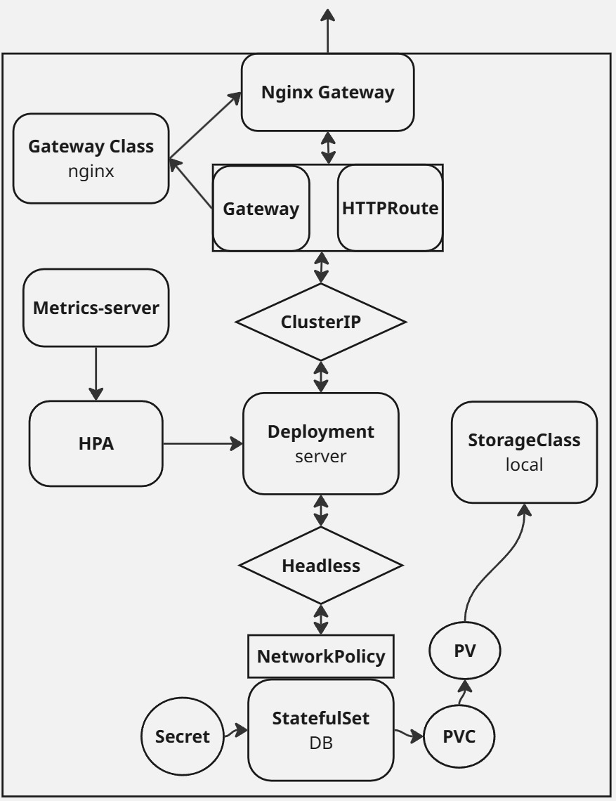

# K8s Mirror

K8s 클러스터와 http 서버 두 개가 포함되어있습니다.  
서버는 각각 다른 팀이 구현 중이라고 가정하고 다른 언어와 데이터베이스를 사용했습니다.

## 구성
1. app(app/): 서비스 코드
2. k8s(k8s/): k8s 리소스 정의. local cluster 전용
3. terraform(terraform/): tf 리소스 정의. EKS 배포용

## 탐색
각 root(app/, k8s/, terraform/)은 하위에 서비스 디렉토리(<service-name>-service)들로 구성되어 있습니다.  
각 서비스 디렉토리의 하위는 서버 소스(server/)와 데이터베이스 소스(db/)로 구성되어 있습니다.

## 서비스
### 계좌 서비스 (app/account-service)
구현: Go, PostgreSQL  
기능: 계좌 생성, 대출 및 상환 요청, 잔고 조회  
  
### 대출 서비스 (app/loan-service)
구현: Node.js, MySQL  
기능: 상환 가능 여부 판단, 대출 및 상환  

### 실행
#### local cluster
스크립트(k8s/cluster.up.sh)로 실행합니다.  
Docker desktop + Kind 클러스터 사용을 가정한 스크립트입니다.  
다른 환경을 사용하고 계시다면 스크립트를 참조해 조정해주세요.

```bash
cd k8s
sh cluster.up.sh
```
#### EKS
terraform(terraform/)으로 배포합니다.

```bash
cd terraform
terraform apply --var-file=demo.tfvars
```

### 서비스의 구성
하나의 서비스는 아래와 같이 동작하며, 각 서비스는 같은 구조를 따릅니다.  
EKS에서는 Gateway API대신 Ingress를 사용합니다. tf에 이미 정의된 리소스들을 사용하기 위해서 입니다.  
storage class, ingress controller 등은 공동 자원입니다.

<br />
 
</img>

# 개발 환경
Kind(Kubernetes v1.32.2) 3 nodes  
Windows docker desktop 4.0.0(Docker 28.0.1)  
WSL2 Ubuntu 22.04  
Terraform v1.11.3

